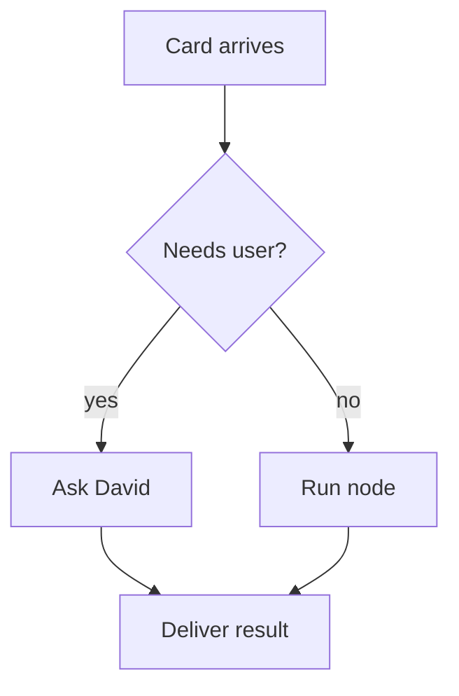

# How a card is handled

Every card goes through this flow:

```mermaid
flowchart TD
  A[Card arrives] --> B{Needs user?}
  B -->|yes| C[Ask David]
  B -->|no| D[Run node]
  C --> E[Deliver result]
  D --> E
```

The node reports back when it is done.
